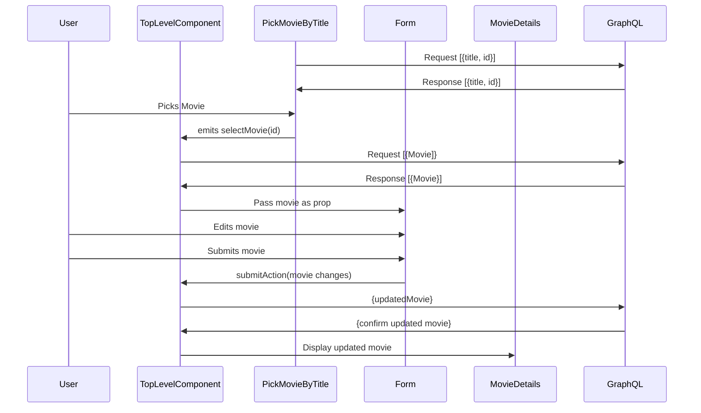

# Updating Movies

Starting from when TopLevelComponent (really UpdatingMoviesWIthGraphQL) loads...

```mermaid
sequenceDiagram
  participant User
  participant TopLevelComponent
  participant PickMovieByTitle
  participant Form
  participant MovieDetails
  participant GraphQL
  PickMovieByTitle->>GraphQL: Request [{title, id}]
  GraphQL->>PickMovieByTitle: Response [{title, id}]
  User->>PickMovieByTitle: Picks Movie
  PickMovieByTitle->>TopLevelComponent: emits selectMovie(id)
  TopLevelComponent->>GraphQL: Request [{Movie]}
  GraphQL->>TopLevelComponent: Response [{Movie}]
  TopLevelComponent->>Form: Pass movie as prop
  User->>Form: Edits movie
  User->>Form: Submits movie
  Form->>TopLevelComponent: submitAction(movie changes)
  TopLevelComponent->>GraphQL: {updatedMovie}
  GraphQL->>TopLevelComponent: {confirm updated movie}
  TopLevelComponent->>MovieDetails: Display updated movie
```